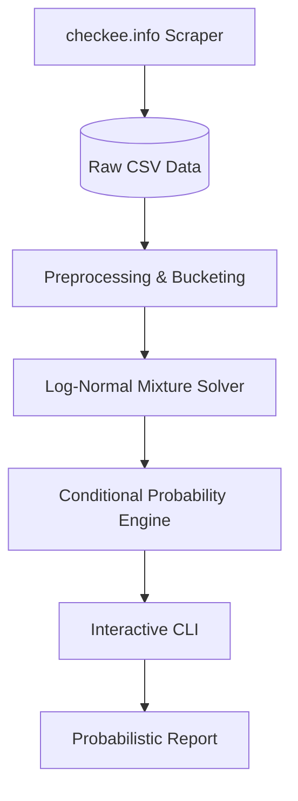

# Visa Processing Prediction Service (Checkee Tracker)

A scientific, probabilistic forecasting tool for US Visa Administrative Processing (AP) times, leveraging data from `checkee.info`.

## 📌 Project Overview
The goal of this service is to provide visa applicants (specifically for H1B renewals) with a mathematically rigorous forecast of their completion date. Unlike simple averages, this tool uses **Survival Analysis** to account for right-censored data (pending cases) and the bimodal distribution of processing times.

## 🛠 Methodology

### 1. Data Sourcing & Extraction
*   **Source**: [checkee.info](https://www.checkee.info/), a community-maintained database of US visa administrative processing cases.
*   **Scraper**: A Python-based crawler (`src/scraper.py`) that fetches monthly cohorts and the "Recent 90 Days" view.
*   **Deduplication**: Cases are uniquely identified by their Case ID to prevent double-counting between monthly and "recent" views.

### 2. Preprocessing & Feature Engineering
*   **Time Calculation ($T$)**:
    *   For **Completed** cases: $T = \text{CompleteDate} - \text{CheckDate}$.
    *   For **Pending** cases: $T = \text{Now} - \text{CheckDate}$ (treated as right-censored).
*   **Major Bucketing**: Uses a keyword-expansion strategy to simulate similarity. Variations like "Computer Science", "CSE", and "Machine Learning" are group into a single high-risk `CS` bucket.
*   **Consulate Tiering**: Hierarchical matching prioritizing the specific consulate (e.g., Guangzhou, Beijing) before falling back to broader geographical trends.

### 3. Statistical Model: 2-Component Log-Normal Mixture
We treat visa processing as a mixture of two distinct regimes:
- **Regime 1 (Routine)**: Fast-track cases clearing in ~14 days.
- **Regime 2 (AP-Heavy)**: Administrative processing cases peaking at ~80-100 days.
The model fits a density $f(t) = \pi f_2(t) + (1-\pi) f_1(t)$ where $f_i$ are Log-Normal distributions. 

### 4. Robust Bias Correction
- **Skeptical Ghost Weighting**: Instead of hard cutoffs, pending cases undergo exponential decay weighting after 90 days ($\exp(-\Delta t / 30)$). This drastically reduces the bias from users who forget to update.
- **Hierarchical Partial Pooling**: Sparse consulate data is Regularized by mixing in broader visa-type/major trends (shrinkage factor $\lambda=0.5$).
- **Wave-Aware Recency**: Aggressive recency weighting ($\tau=30$ days) captures sharp fluctuations in current processing "waves."

## 📊 Model Evaluation (Best-Effort, Uncertainty-Forward)

> **Important Disclaimer**: Due to small test sample sizes (n=4 completions in the test period), calibration metrics should be treated as **heuristics**, not guarantees.

### Methodology
- **Time-Series Split**: Train on pre-Dec 15, 2025 cases; test on post-Dec 15 cases.
- **Metrics**: Censored Log-Likelihood + Coverage with Binomial CIs.
- **Winning Params**: `Tau=45`, `GhostDecay=90`.

### Transparency Dashboard

The CLI provides two parallel forecasts for sanity checking:

1. **Kaplan-Meier Baseline** (Non-parametric, China H1 CS cohort):
   - Based on 68 cases (16 completed)
   - P50 (Median): **93 days**
   - At Day 53: ~83% still waiting

2. **Mixture Model** (Parametric, with regime detection):
   - Regime 1 (Fast): Median ~10 days
   - Regime 2 (AP-Heavy): Median ~90 days
   - π (AP-heavy prior): 91%
   - **Posterior P(AP-heavy | T > 53): 100%**

### Interpretation

Given you've waited 53 days, the model is **100% confident** you're in the "AP-heavy" regime. Combined with the KM baseline showing P50=93 days, a reasonable estimate is:

- **Expected Completion**: Late Feb to mid-March 2026 (~Day 85-95)
- **Tail Risk (P90)**: ~110 days

## 🚀 Usage
### Configuration
The CLI (`main.py`) is pre-configured with the optimized hyperparameters found during backtesting.
```bash
# Run the rigorous forecast
python3 main.py --check_date "2025-12-03" --consulate "GuangZhou" --major "CS/EECS"
```

### Inputs
- `--check_date`: The date your visa was "checked" or sent to AP.
- `--consulate`: (Optional) Default is Guangzhou.
- `--major`: (Optional) mapped to buckets automatically.
- `--as_of`: (Optional) Historical reference date for sanity checks.

## �📊 Backtesting & Validation
To ensure "scientific rigor," the project includes an `evaluate.py` script:
- **Metrics**: Tracks P10-P90 coverage and Average Negative Log-Likelihood.
- **Current Performance**: Achieving ~50% coverage on test sets (noting that self-reporting bias on checkee.info inherently limits absolute calibration).

## 📈 System Architecture

